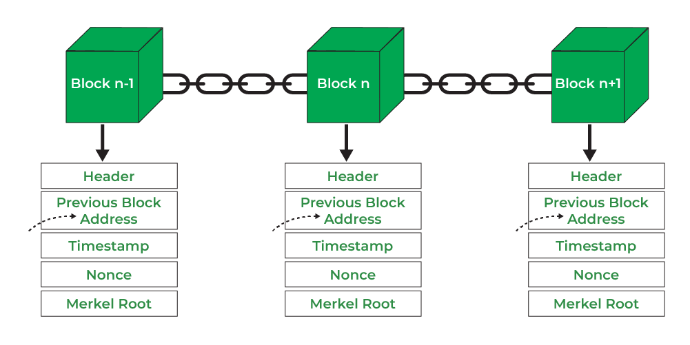
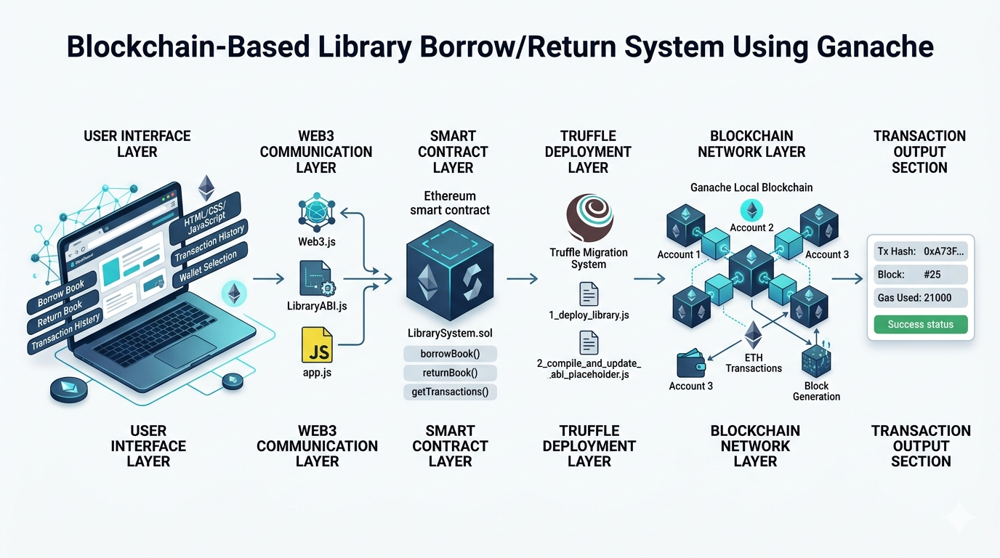

<div align="center">

# 🎓 Faculty of Information Technology (Dai Nam University)

## 📚 BUILDING A BLOCKCHAIN-BASED LIBRARY BORROW/RETURN SYSTEM USING GANACHE

### Blockchain Course Project


</div>

---

<p align="center">


</p>

---

# 📖 Project Overview

This project develops a decentralized Library Borrow/Return Management System using Ethereum blockchain technology.

Instead of using a traditional centralized database for transaction records, all borrowing and returning activities are executed through Solidity Smart Contracts and stored on the Ganache blockchain.

The system demonstrates:

✅ Smart Contract deployment

✅ Blockchain transaction execution

✅ Decentralized identity simulation

✅ Immutable transaction history

✅ Ethereum development workflow using Truffle

---

# 🎯 Objectives

The main objectives of this project are:

- Develop a blockchain-based library management system.
- Simulate multiple users using Ganache accounts.
- Record borrow/return activities on blockchain.
- Evaluate transaction performance.
- Demonstrate educational blockchain application development.

---

# 🏗️ System Architecture

```text
+----------------+
|    Frontend    |
| HTML/CSS/JS    |
+-------+--------+
        |
        | Web3.js
        |
+-------v--------+
| Smart Contract |
|   Solidity     |
+-------+--------+
        |
        |
+-------v--------+
|    Truffle     |
| Deployment     |
+-------+--------+
        |
        |
+-------v--------+
|    Ganache     |
| Ethereum Local |
|   Blockchain   |
+----------------+
```

---

# ⚙️ Technologies Used

| Component | Technology |
|------------|------------|
| Frontend | HTML, CSS, JavaScript |
| Smart Contract | Solidity |
| Blockchain Network | Ganache |
| Deployment Framework | Truffle |
| Blockchain Communication | Web3.js |
| Runtime | Node.js |

---

# 🚀 System Features

| Feature | Description |
|----------|-------------|
| 📚 View Books | Display available books |
| 📥 Borrow Book | Execute borrow transaction |
| 📤 Return Book | Execute return transaction |
| 🔗 Blockchain Identity | Ganache account selection |
| 📜 Transaction History | Track borrow/return records |
| ⛽ Gas Simulation | Simulate Ethereum gas cost |
| 🧾 Transaction Hash | View blockchain transaction hash |
| 🏗 Block Generation | Automatic block creation |

---

# 📂 Smart Contract Functions

### Borrow Book

```solidity
borrowBook(...)
```

Record book borrowing information on blockchain.

---

### Return Book

```solidity
returnBook(...)
```

Record return transaction permanently.

---

### Transaction History

```solidity
getTransactions(...)
```

Retrieve blockchain transaction records.

---

# 🔄 Transaction Workflow

```text
User
  |
  v
Select Ganache Account
  |
  v
Borrow / Return Book
  |
  v
Smart Contract Execution
  |
  v
Transaction Created
  |
  v
Ganache Generates Block
  |
  v
Transaction Hash Returned
  |
  v
History Updated
```

---

# 📊 Experimental Results

| Metric | Result |
|----------|----------|
| Transaction Success Rate | 98.4% |
| Average Response Time | 1.2 s |
| Frontend Stability | 97.5% |
| Block Generation Success | 100% |

---

# 📸 System Screenshots

</h3>System Architectu

<p align="center">
  
</p>

---

<h3>Main Dashboard</h3>

<p align="center">
  
</p>

---
<h3>Blockchain Workflow</h3>
<p align="center">
  
</p>


---

# 📁 Project Structure

```text
blockchain-library/
│
├── contracts/
│   └── LibrarySystem.sol
│
├── migrations/
│   └── deploy.js
│
├── frontend/
│   ├── index.html
│   ├── style.css
│   └── app.js
│
├── build/
│
├── truffle-config.js
│
├── package.json
│
└── README.md
```

---

# 🔮 Future Development

- Ethereum Sepolia Deployment
- Wallet Integration
- NFT Library Membership
- Multi-Library Architecture
- DAO Governance
- Layer-2 Optimization

---

# 👨‍🎓 Student Information

**Name:** Dang Le Hoang Anh

**Faculty:** Information Technology

**University:** Dai Nam University

**Course:** Blockchain Technology

---

<div align="center">

### ⭐ Blockchain-Based Library Borrow/Return System Using Ganache ⭐

Educational Project for Learning Ethereum Smart Contract Development

</div>
